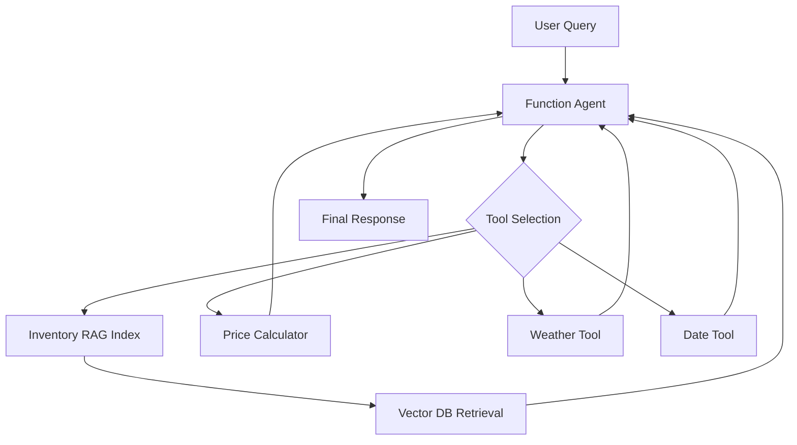
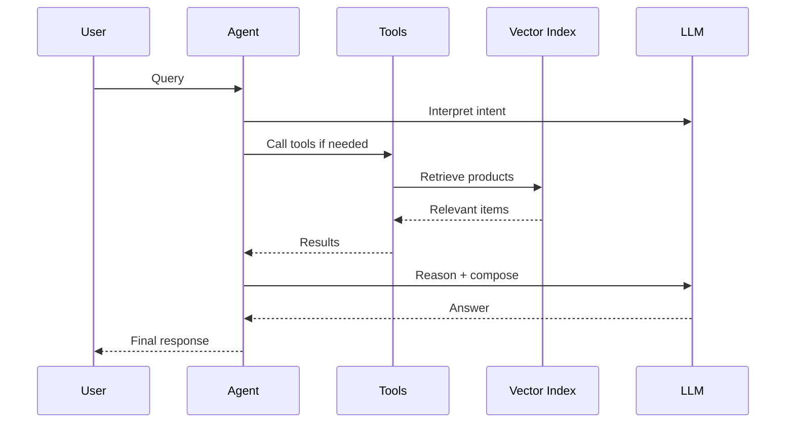

# 🧠 Production-Grade RAG Shopping Assistant (Ultra Version)

## 🚀 Overview

This project implements a **production-grade, agent-driven RAG system** for a shopping assistant.

It demonstrates a full evolution:

```
Naive RAG → Structured Retrieval → Tooling → Agent → Context-Aware System
```

This is aligned with **modern LLM system design patterns** used in real-world AI products.

---

## 🏗️ System Architecture (High-Level)



---

## 🔬 Detailed Data Flow



---

## ⚙️ Core Components

### 1. Vector Index (RAG Layer)
- LlamaIndex `VectorStoreIndex`
- Embeddings over product descriptions
- Metadata embedded into text

### 2. Tools Layer
- `inventory_query_tool`
- `calculate_total_price`
- `get_current_date`
- `get_weather`

### 3. Agent Layer
- FunctionAgent (tool-calling)
- multi-step reasoning
- dynamic tool orchestration

---

## 🧩 Design Patterns

### Pattern 1 — RAG as Knowledge Layer
- retrieval provides **facts**
- prevents hallucination

### Pattern 2 — Tools as Capabilities
- deterministic operations
- external integrations

### Pattern 3 — Agent as Orchestrator
- decides *what to do*
- not just *what to say*

---

## 📊 Performance Considerations

### Latency

| Component | Cost |
|----------|------|
| Embedding | medium |
| Retrieval | low |
| LLM reasoning | high |

### Optimization strategies

- reduce top_k
- cache embeddings
- pre-filter products
- use cheaper models for tool calls

---

## 💰 Cost Optimization

- batch embedding during indexing
- reuse persisted index
- minimize tool calls
- avoid long prompts

---

## 🧪 Evaluation Strategy

### Metrics

- Retrieval relevance (top-k accuracy)
- Answer grounding
- Cost per query
- Latency
- Tool usage correctness

### Methods

- LLM-as-a-judge
- golden dataset
- adversarial queries

---

## ⚠️ Failure Modes

### 1. Retrieval failure
- irrelevant products returned

### 2. Tool misuse
- wrong tool selection

### 3. Over-reasoning
- unnecessary tool calls

### 4. Hallucination
- mitigated via RAG grounding

---

## 🔐 Production Concerns

### Reliability
- retry failed tool calls
- fallback answers

### Observability
- logging tool calls
- tracing (LangSmith)

### Security
- validate inputs
- sanitize tool outputs

---

## 🔮 Scaling Strategy

### Horizontal scaling
- separate retrieval service
- async tool execution

### Data scaling
- move to real vector DB:
  - Pinecone
  - Weaviate
  - Qdrant

### Feature scaling
- add filters (size, color, brand)
- user personalization
- session memory

---

## 🧠 Interview Narrative

You can present this as:

> Designed and implemented a production-style RAG system with agent-based orchestration, combining vector retrieval, tool usage, and contextual reasoning for a shopping assistant use case.

### Key highlights

- moved beyond naive RAG
- implemented tool-based architecture
- enabled multi-step reasoning
- added contextual intelligence (weather)

---

## 🏁 Final Insight

This project reflects a critical shift:

```
LLMs are not just generators
→ they are decision-makers in systems
```

And this is exactly what modern AI engineering requires.
